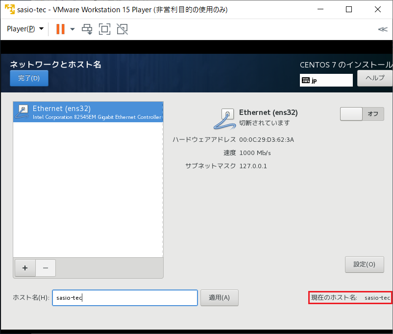

# CentOS7.5のインストール

### #前提条件
VM wareがインストールされていること  

### #Windows上でインストール

01_「Welcome TO CentOS7」の画面が表示されたら左列で日本語を選択して［continue］ボタンをクリックする  
  
02_インストールの概要のメニュー一覧が表示されたことを確認する  
  
03_インストールの概要のメニュー一覧「日本語と時刻」をクリックする  
  
04_地域(R)［アジア　▼］また都市(C)［東京　▼］になっていること  
  
05_［完了(D)］ボタンをクリックする  
   
06_インストールの概要のメニュー一覧「キーボード」をクリックする  
   
07_［　日本語　］になっていることを確認する  
  
08_［完了(D)］ボタンをクリックする  
    
09_インストールの概要のメニュー一覧「インストール先(D)」をクリックする  
  
10_仮想マシンを作成する際に指定したディスク容量になっていること  
  
11_［完了(D)］ボタンをクリックする  
  
12_インストールの概要のメニュー一覧「KDUMP」をクリックする  

13_チェックがついているためチェックを外す  
  
14_［完了(D)］ボタンをクリックする  
  
15_インストールの概要のメニュー一覧「ネットワークとホスト」をクリックする  
  
16_ホスト名(H)［(例)sasio-tec］を入力する  
  
17_ホスト名を入力後に［適用］ボタンをクリックする
  
18_現在のホスト名が指定したホスト名になったことを確認する  
    
19_［完了(D)］ボタンをクリックする  
    
20_［インストールの開始(B)］ボタンをクリックする  
   
21_ユーザの設定のメニュー一覧が表示されたことを確認する  
   
22_ユーザの設定のメニュー一覧「ユーザーの作成」をクリックする  
   
23_フルネーム(F)［mainte］またパスワード(P)［※英数字記号］を入力する  
   
24_［完了(D)］ボタンをクリックする  
    
25_ユーザの設定のメニュー一覧「ROOTパスワード(R)」をクリックする  
  
26_rootパスワード(P)［※英数字記号］を入力する  
  
27_［完了(D)］ボタンをクリックする  
  
28_［設定完了(F)］ボタンをクリックする  
  
29_インストール開始したことを確認する  
  
30_［再起動(R)］ボタンをクリックする  
  
